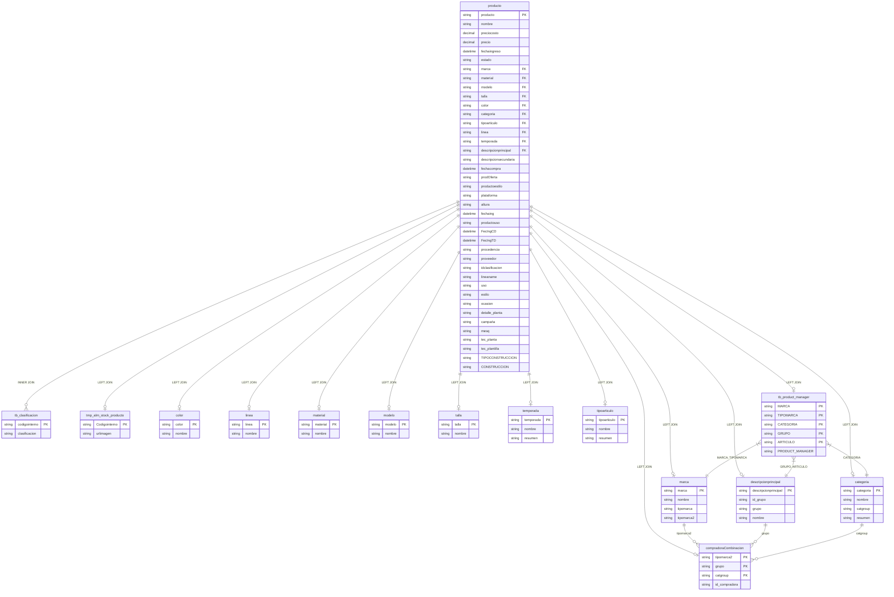

# Diagrama de Entidad Relación para vw_Producto:

### **Notas importantes sobre el diagrama**
1. La entidad principal es `producto` que se relaciona con múltiples tablas de referencia
2. Se muestran las relaciones INNER JOIN (con tb_clasificacion) y LEFT JOIN (con las demás tablas)
3. La tabla compradoraCombinacion tiene una relación compuesta con marca, descripcionprincipal y categoria
4. La tabla tb_product_manager tiene una relación compuesta con múltiples campos de otras tablas
5. Se incluyen los campos PK (Primary Key) y FK (Foreign Key) relevantes
6. La vista filtra productos donde temporada > '61' y excluye los productos listados en tb_productos_excluidos