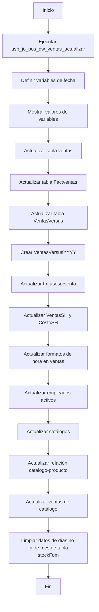
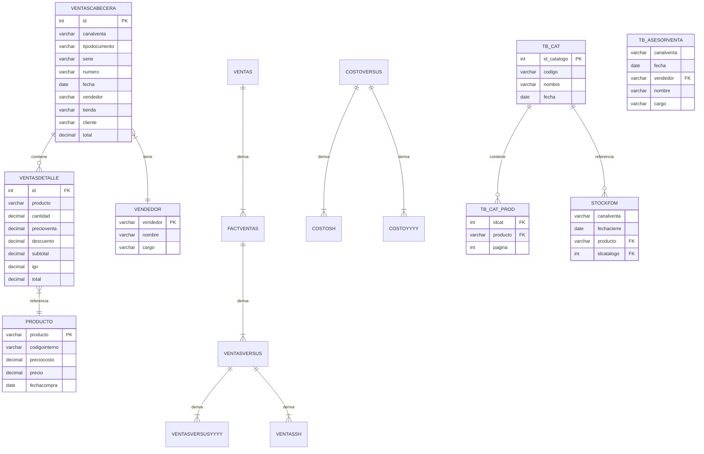

# Análisis del Stored Procedure `usp_jo_pos_dw_cubo_actualizar`

## 1. Diagrama de Flujo de Datos

## 2. Diagrama de Entidad-Relación

??? info "Notas importantes sobre el diagrama"
    ## Observaciones sobre el modelo

    1. **Ventas**: El procedimiento trabaja con varias tablas de ventas que parecen ser versiones o transformaciones de los mismos datos básicos (ventas, Factventas, VentasVersus, VentasSH).

    2. **Jerarquía de datos**: Las ventas fluyen desde ventascabecera/ventasdetalle hasta las tablas analíticas finales.

    3. **Catálogos**: Existe un sistema de catálogos (tb_cat) que se relaciona con productos (tb_cat_prod) y afecta a las ventas y stock.

    4. **Dimensiones**: Se identifican dimensiones clave como tiempo, productos, vendedores y tiendas.

    5. **Transformaciones**: El procedimiento realiza varias transformaciones de datos, especialmente en el formato de fechas y horas.

    El modelo refleja un data warehouse con tablas de hechos (ventas) y dimensiones (productos, vendedores, tiempo), con procesos ETL para mantener los datos actualizados.