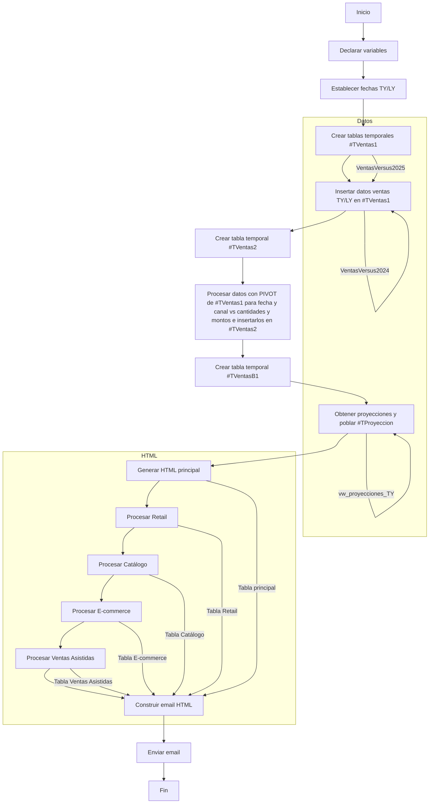

# DIAGRAMA DE FLUJO DEL PROCESO VDM:

---

### 🧭 **Descripción General**

Este flujo representa el proceso automatizado de generación y envío de un reporte de ventas (VDM) por correo electrónico. El proceso incluye la preparación de datos, procesamiento analítico, generación de reportes HTML y envío de resultados.

---

### 🔄 **Etapas del Proceso**

1. **Inicio (`A`)**
   - Punto de partida del procedimiento almacenado.

2. **Declaración de Variables (`B`)**
   - Se definen variables necesarias para el procesamiento, como fechas, acumuladores y estructuras temporales.

3. **Establecer Fechas TY/LY (`C`)**
   - Se calculan las fechas de análisis para el año actual (TY) y el año anterior (LY).

4. **Crear Tabla Temporal `#TVentas1` (`D`)**
   - Se crea una tabla temporal para almacenar datos de ventas.

5. **Insertar Datos de Ventas TY/LY (`E`)**
   - Se cargan datos de ventas del año actual y anterior en `#TVentas1`.

6. **Crear Tabla Temporal `#TVentas2` (`F`)**
   - Se crea una segunda tabla temporal para almacenar datos procesados.

7. **Procesar Datos con PIVOT (`G`)**
   - Se realiza un PIVOT sobre `#TVentas1` para reorganizar los datos por fecha y canal, y se insertan en `#TVentas2`.

8. **Crear Tabla Temporal `#TVentasB1` (`H`)**
   - Se prepara una tabla adicional para consolidar datos.

9. **Obtener Proyecciones (`I`)**
   - Se consultan proyecciones desde la vista `vw_proyecciones_TY` y se insertan en `#TProyeccion`.

10. **Generar HTML Principal (`J`)**
    - Se construye la tabla HTML principal del reporte.

11. **Procesar Retail (`K`)**
12. **Procesar Catálogo (`L`)**
13. **Procesar E-commerce (`M`)**
14. **Procesar Ventas Asistidas (`N`)**
    - Cada uno de estos pasos genera una tabla HTML específica para el canal correspondiente.

15. **Construir Email HTML (`O`)**
    - Se ensamblan todas las tablas HTML en un solo cuerpo de correo.

16. **Enviar Email (`P`)**
    - Se envía el correo electrónico con el reporte.

17. **Fin (`Q`)**
    - Finaliza la ejecución del procedimiento.

---

### 📦 **Subprocesos y Recursos**

#### 📊 Subproceso: Datos
- `VentasVersus2025` y `VentasVersus2024` alimentan `#TVentas1`.
- `vw_proyecciones_TY` alimenta `#TProyeccion`.

#### 🖥️ Subproceso: HTML
- Cada bloque de procesamiento de canal genera una tabla HTML que se integra en el cuerpo del correo.