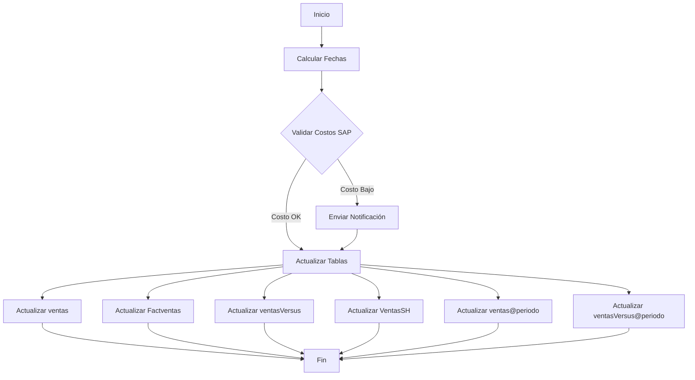
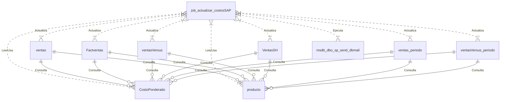

# Diagrama de Flujo de Datos (DFD) para job_actualizar_costosSAP

## Nivel 1: Procesos Principales

```mermaid
flowchart TD
    A[Inicio] --> B[Calcular Fechas]
    B --> C{Validar Costos SAP}
    C -->|Costo Bajo| D[Enviar Notificación]
    C -->|Costo OK| E[Actualizar Tablas]
    E --> F[Actualizar ventas]
    E --> G[Actualizar Factventas]
    E --> H[Actualizar ventasVersus]
    E --> I[Actualizar VentasSH]
    E --> J[Actualizar ventas@periodo]
    E --> K[Actualizar ventasVersus@periodo]
    D --> E
    F --> L[Fin]
    G --> L
    H --> L
    I --> L
    J --> L
    K --> L
```

## Nivel 3: Dependencias de Datos

```mermaid
erDiagram
    job_actualizar_costosSAP }|..|{ CostoPonderado : "Lee/Usa"
    job_actualizar_costosSAP }|..|{ producto : "Lee/Usa"
    job_actualizar_costosSAP }|..|{ ventas : "Actualiza"
    job_actualizar_costosSAP }|..|{ Factventas : "Actualiza"
    job_actualizar_costosSAP }|..|{ ventasVersus : "Actualiza"
    job_actualizar_costosSAP }|..|{ VentasSH : "Actualiza"
    job_actualizar_costosSAP }|..|{ ventas_periodo : "Actualiza"
    job_actualizar_costosSAP }|..|{ ventasVersus_periodo : "Actualiza"
    job_actualizar_costosSAP }|..|{ msdb_dbo_sp_send_dbmail : "Ejecuta"
    
    ventas ||--o{ CostoPonderado : "Consulta"
    ventas ||--o{ producto : "Consulta"
    Factventas ||--o{ CostoPonderado : "Consulta"
    Factventas ||--o{ producto : "Consulta"
    ventasVersus ||--o{ CostoPonderado : "Consulta"
    ventasVersus ||--o{ producto : "Consulta"
    VentasSH ||--o{ CostoPonderado : "Consulta"
    VentasSH ||--o{ producto : "Consulta"
    ventas_periodo ||--o{ CostoPonderado : "Consulta"
    ventas_periodo ||--o{ producto : "Consulta"
    ventasVersus_periodo ||--o{ CostoPonderado : "Consulta"
    ventasVersus_periodo ||--o{ producto : "Consulta"
```