## 1. Diagrama de Entidad Relación

```mermaid
erDiagram
    vw_proyecciones_TY {
        string Canal
        string SubCanal
        string MedioVenta
        decimal monto
        string fecha
        decimal margen
        decimal utilidad
        decimal Par
        decimal Acc
        int id_medioventa
        string supervisor
        string email
        string codigo
        string NombreTienda
        string Estado
        date Fecha_LY
        date Fecha_TY
        int UndPar_LY
        int UndAcc_LY
        int Und_LY
        decimal VtaPar_LY
        decimal VtaAcc_LY
        decimal Vta_LY
        decimal CtoPar_LY
        decimal CtoACC_LY
        decimal Cto_LY
        decimal MgPar_LY
        decimal MgAcc_LY
        decimal Mg_LY
        decimal UtiPar_LY
        decimal UtiAcc_LY
        decimal Uti_LY
        int UndDepor_TY
        int Und_No_Depor_TY
        int UndPar_TY
        int UndAcc_TY
        int Und_TY
        decimal VtaDepor_TY
        decimal Vta_No_Depor_TY
        decimal VtaPar_TY
        decimal VtaAcc_TY
        decimal Vta_TY
        decimal CtoPar_TY
        decimal CtoACC_TY
        decimal Cto_TY
        decimal MgPar_TY
        decimal MgAcc_TY
        decimal Mg_TY
        decimal UtiPar_TY
        decimal UtiAcc_TY
        decimal Uti_TY
        string canalventa
    }

    proyecciones {
        decimal monto
        string fecha
        decimal margen
        decimal utilidad
        decimal Par
        decimal Acc
        int id_medioventa
        string Supervisor
    }

    vw_canalsubcanal {
        string Canal
        string SubCanal
        string MedioVenta
        int id_medioventa
    }

    tb_xls_proy_24_all {
        string NombreTienda
        string Estado
        date Fecha_2023
        date Fecha_2024
        int UndDepor_2023
        int Und_No_Depor_2023
        int UndAcc_2023
        int Und_2023
        decimal VtaDepor_2023
        decimal Vta_No_Depor_2023
        decimal VtaAcc_2023
        decimal Vta_2023
        decimal CtoPar_2023
        decimal CtoACC_2023
        decimal Cto_2023
        decimal MgDepor_2023
        decimal Mg_NoDepor_2023
        decimal MgAcc_2023
        decimal Mg_2023
        decimal UtiD_2023
        decimal UtiND_2023
        decimal UtiAcc_2023
        decimal Uti_2023
        int UndDepor_2024
        int Und_No_Depor_2024
        int UndAcc_2024
        int Und_2024
        decimal VtaDepor_2024
        decimal Vta_No_Depor_2024
        decimal VtaAcc_2024
        decimal Vta_2024
        decimal CtoDepor_2024
        decimal Cto_No_Depor_2024
        decimal CtoACC_2024
        decimal Cto_2024
        decimal MgDepor_2024
        decimal Mg_No_Depor_2024
        decimal MgAcc_2024
        decimal Mg_2024
        decimal UtiD_2024
        decimal UtiND_2024
        decimal UtiAcc_2024
        decimal Uti_2024
        string MedioVenta
        int id_medioventa
    }

    tb_xls_proy_TY_all {
        string NombreTienda
        string Estado
        date Fecha_LY
        date Fecha_TY
        int UndDepor_LY
        int Und_No_Depor_LY
        int UndAcc_LY
        int Und_LY
        decimal VtaDepor_LY
        decimal Vta_No_Depor_LY
        decimal VtaAcc_LY
        decimal Vta_LY
        decimal CtoPar_LY
        decimal CtoACC_LY
        decimal Cto_LY
        decimal MgDepor_LY
        decimal Mg_NoDepor_LY
        decimal MgAcc_LY
        decimal Mg_LY
        decimal UtiD_LY
        decimal UtiND_LY
        decimal UtiAcc_LY
        decimal Uti_LY
        int UndDepor_TY
        int Und_No_Depor_TY
        int UndAcc_TY
        int Und_TY
        decimal VtaDepor_TY
        decimal Vta_No_Depor_TY
        decimal VtaAcc_TY
        decimal Vta_TY
        decimal CtoDepor_TY
        decimal Cto_No_Depor_TY
        decimal CtoACC_TY
        decimal Cto_TY
        decimal MgDepor_TY
        decimal Mg_No_Depor_TY
        decimal MgAcc_TY
        decimal Mg_TY
        decimal UtiD_TY
        decimal UtiND_TY
        decimal UtiAcc_TY
        decimal Uti_TY
        string MedioVenta
        int id_medioventa
        string Canal
    }

    supervisor {
        string nombre
        string email
        string codigo
        string tienda
    }

    vw_proyecciones_TY }|--|| proyecciones : "LEFT JOIN on id_medioventa and fecha"
    vw_proyecciones_TY }|--|| vw_canalsubcanal : "LEFT JOIN on id_medioventa"
    vw_proyecciones_TY }|--|| tb_xls_proy_24_all : "LEFT JOIN on id_medioventa and fecha (2024)"
    vw_proyecciones_TY }|--|| tb_xls_proy_TY_all : "LEFT JOIN on id_medioventa and fecha (TY)"
    vw_proyecciones_TY }|--|| supervisor : "LEFT JOIN on nombre=Supervisor"
    vw_proyecciones_TY }|--|| supervisor : "LEFT JOIN on tienda=MedioVenta+canal"
```

??? info "Notas importantes sobre el diagrama"
    ## 2. Notas sobre el diagrama
    1. La vista `vw_proyecciones_TY` combina datos de múltiples tablas mediante UNION ALL de dos consultas principales.
    2. La primera parte usa datos de `tb_xls_proy_24_all` para fechas antes del 1 de agosto de 2024.
    3. La segunda parte usa datos de `tb_xls_proy_TY_all` para fechas posteriores al 31 de julio de 2024.
    4. Hay dos relaciones con la tabla `supervisor`: una por nombre y otra por tienda+canal.
    5. Todas las relaciones son LEFT JOIN para preservar los registros incluso cuando no hay coincidencia.
    6. La vista incluye datos históricos (LY - Last Year) y de proyección (TY - This Year).