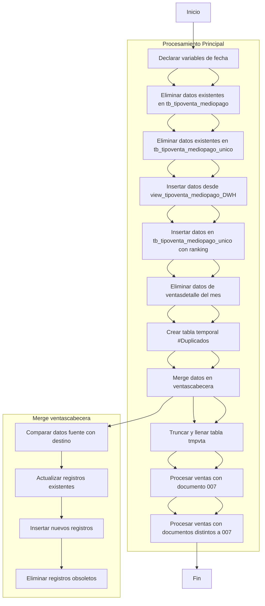
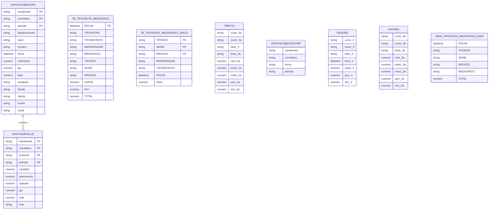

# Análisis del Procedimiento Almacenado

## 1. Diagrama de Flujo de Datos

## 2. Diagrama de Entidad-Relación

??? info "Notas importantes sobre el diagrama"
    ## Explicación de los diagramas

    ### Diagrama de Flujo de Datos:
    1. Comienza declarando variables de fecha para el procesamiento
    2. Limpia tablas de destino (tb_tipoventa_mediopago y tb_tipoventa_mediopago_unico)
    3. Inserta datos desde la vista view_tipoventa_mediopago_DWH
    4. Crea registros únicos en tb_tipoventa_mediopago_unico usando RANK()
    5. Elimina datos antiguos de ventasdetalle
    6. Crea tabla temporal #Duplicados para filtrar registros problemáticos
    7. Realiza operación MERGE en ventascabecera (actualiza/inserta/elimina)
    8. Procesa datos de ventas (normales y anulaciones - documento 007)

    ### Diagrama Entidad-Relación:
    - Muestra las principales tablas involucradas:
    - Tablas destino: VENTASCABECERA, VENTASDETALLE, TB_TIPOVENTA_MEDIOPAGO
    - Tablas temporales: TMPVTA, VENTASCABECERATMP
    - Tablas origen: FAG0300 (cabeceras), FAP0300 (detalles), VIEW_TIPOVENTA_MEDIOPAGO_DWH
    - Destaca las relaciones principales y los campos clave
    - Incluye los campos más relevantes para entender el flujo de datos

    El procedimiento maneja principalmente datos de ventas POS (Point of Sale) con información de cabecera, detalle, medios de pago y tipos de venta.