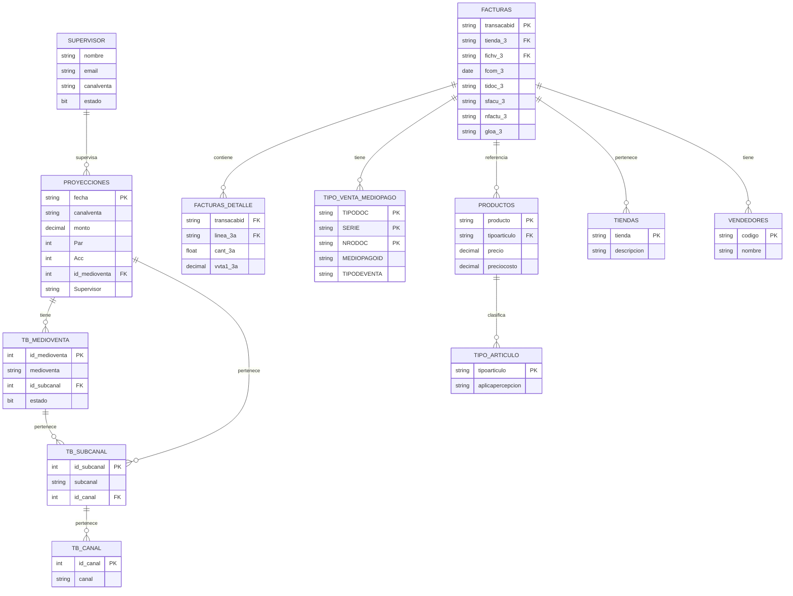

## 2. Diagrama de Entidad-Relación (DER)

??? info "Notas importantes sobre el diagrama"
    ## Explicación del Diagrama Entidad-Relación
    - Representa las principales entidades involucradas en el proceso y sus relaciones.
    - Las entidades principales son:
        - `PROYECCIONES`: Datos de metas/objetivos de venta
        - `FACTURAS` y `FACTURAS_DETALLE`: Datos transaccionales de ventas
        - `TB_CANAL`, `TB_SUBCANAL`, `TB_MEDIOVENTA`: Estructura organizacional de canales de venta
        - `SUPERVISOR`: Responsables de cada canal/medio de venta
        - `PRODUCTOS` y `TIPO_ARTICULO`: Catálogo de productos
