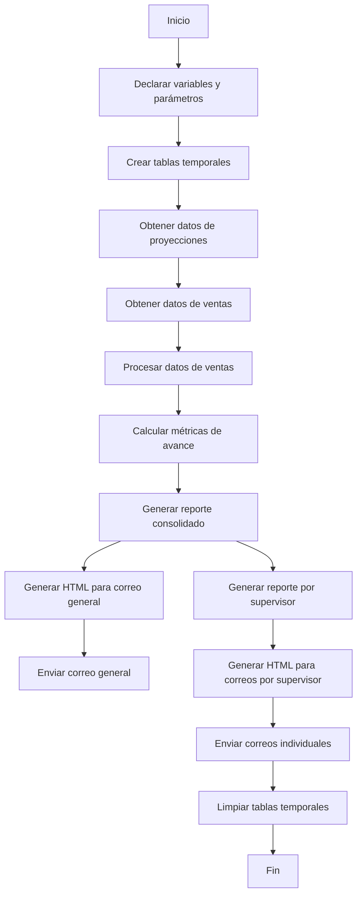

# Análisis del Stored Procedure `job_email_ACH_2024.sql`

## 1. Diagrama de Flujo de Datos (DFD)

??? info "Notas importantes sobre el diagrama"
    ## Explicación del Diagrama de Flujo de Datos
    - Muestra el proceso principal del stored procedure desde la inicialización hasta el envío de correos.
    - Destaca las etapas clave como obtención de datos, procesamiento, generación de reportes y envío de correos.

    El stored procedure es complejo y realiza múltiples funciones:
    - Consulta datos de ventas reales vs proyecciones
    - Calcula métricas de desempeño (avances, márgenes)
    - Genera reportes HTML detallados
    - Distribuye la información por correo electrónico a diferentes destinatarios según su rol