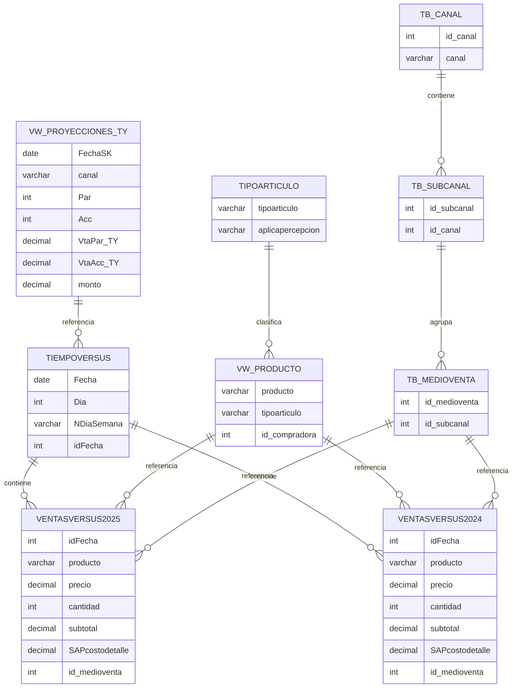

# DIAGRAMA ENTIDAD RELACION DEL PROCESO VENTAS DIARIAS DEL MES:

[🔍 Ver VW_PRODUCTO](/procesos/data-warehouse/vistas/ER-vw_Producto/){target=_blank}
[🔍 Ver VW_PROYECCIONES_TY](/procesos/data-warehouse/vistas/ER-vw_proyecciones_TY/){target=_blank}

??? info "Notas importantes sobre el diagrama"
    ### 🧩 **Descripción General**

    Este diagrama ER modela las relaciones entre las tablas y vistas utilizadas en el proceso de análisis y reporte de ventas del sistema VDM. Incluye datos históricos, proyecciones, productos, canales de venta y jerarquías comerciales.

    ---

    ### 🧱 **Entidades y Atributos**

    #### 📅 `TIEMPOVERSUS`
    - `Fecha`: Fecha del registro.
    - `Dia`: Día numérico.
    - `NDiaSemana`: Nombre del día de la semana.
    - `idFecha`: Identificador único de la fecha.

    #### 📊 `VENTASVERSUS2025` y `VENTASVERSUS2024`
    - `idFecha`: Relaciona con `TIEMPOVERSUS`.
    - `producto`: Código del producto.
    - `precio`: Precio unitario.
    - `cantidad`: Unidades vendidas.
    - `subtotal`: Total de la venta.
    - `SAPcostodetalle`: Costo SAP.
    - `id_medioventa`: Relaciona con `TB_MEDIOVENTA`.

    #### 📦 `VW_PRODUCTO`
    - `producto`: Código del producto.
    - `tipoarticulo`: Tipo de artículo.
    - `id_compradora`: Identificador de la compradora.

    #### 🏷️ `TIPOARTICULO`
    - `tipoarticulo`: Tipo de artículo.
    - `aplicapercepcion`: Indicador de percepción.

    #### 🛒 `TB_MEDIOVENTA`
    - `id_medioventa`: Identificador del medio de venta.
    - `id_subcanal`: Relaciona con `TB_SUBCANAL`.

    #### 🧭 `TB_SUBCANAL`
    - `id_subcanal`: Identificador del subcanal.
    - `id_canal`: Relaciona con `TB_CANAL`.

    #### 🛍️ `TB_CANAL`
    - `id_canal`: Identificador del canal.
    - `canal`: Nombre del canal.

    #### 📈 `VW_PROYECCIONES_TY`
    - `FechaSK`: Fecha de proyección.
    - `canal`: Canal de venta.
    - `Par`, `Acc`: Unidades proyectadas.
    - `VtaPar_TY`, `VtaAcc_TY`: Ventas proyectadas.
    - `monto`: Monto total proyectado.

    ---

    ### 🔗 **Relaciones**

    - `TIEMPOVERSUS` contiene múltiples registros en `VENTASVERSUS2025` y `VENTASVERSUS2024`.
    - `VW_PRODUCTO` referencia productos en ambas tablas de ventas.
    - `TIPOARTICULO` clasifica productos en `VW_PRODUCTO`.
    - `TB_MEDIOVENTA` es referenciado por ambas tablas de ventas.
    - `TB_SUBCANAL` agrupa medios de venta.
    - `TB_CANAL` contiene subcanales.
    - `VW_PROYECCIONES_TY` referencia fechas en `TIEMPOVERSUS`.

