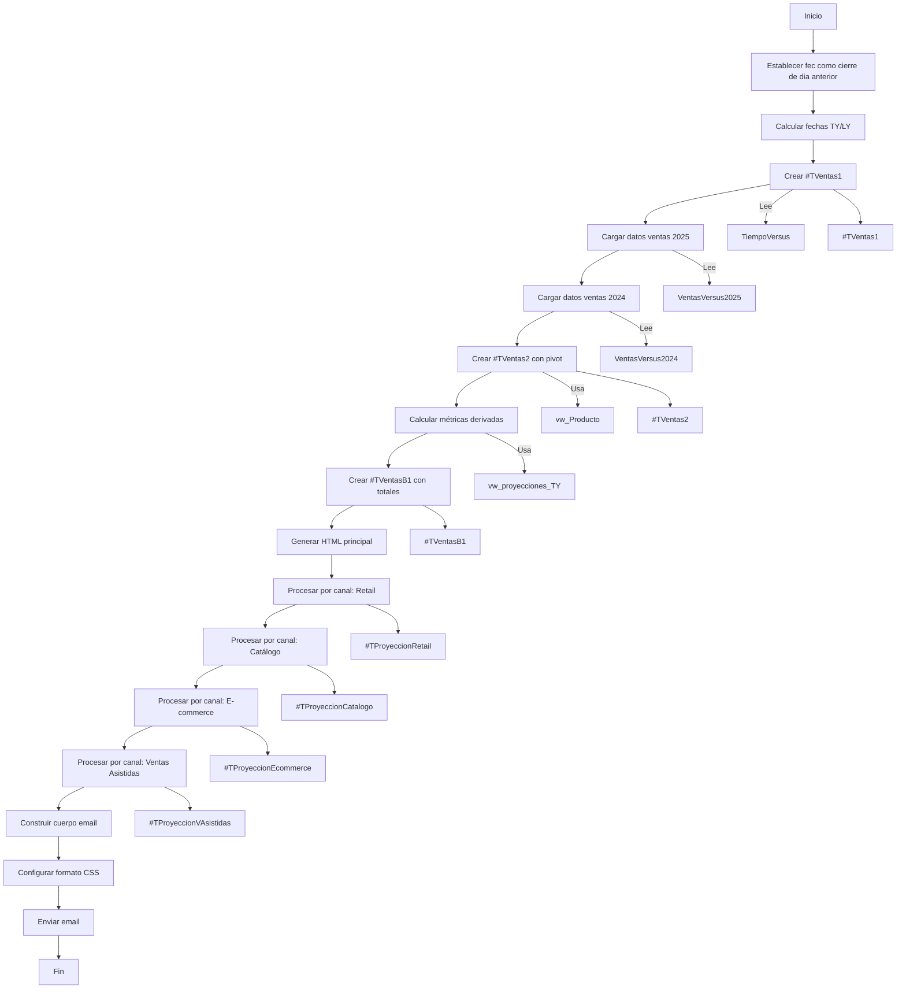

## VDM: Ventas Diarias del Mes en curso
**OBJETIVO:** Envío automatizado por correo del informe de venta diaria del mes:
- A nivel empresa
- A nivel de canal de venta

**Nombre de SP:** job_email_VDM_6
