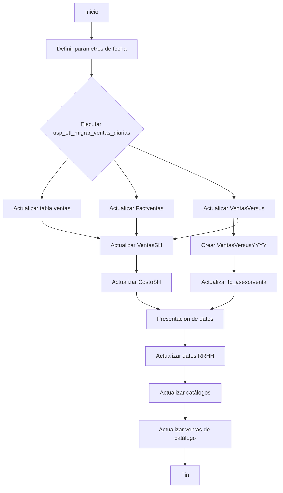
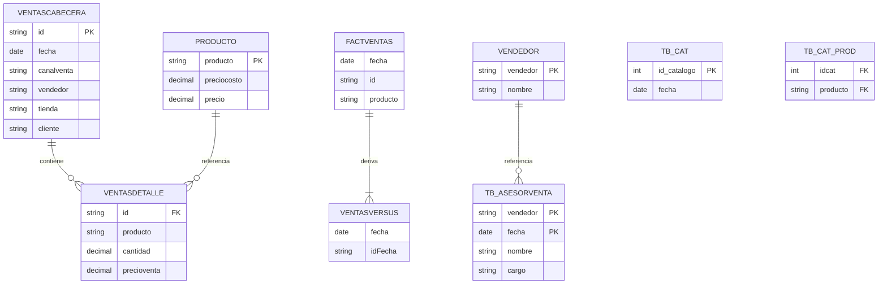

# Documentación del Proceso ETL para Actualización del Cubo de Ventas Diarias

## 1. Diagrama de Flujo de Datos (DFD)

??? info "Explicación del DFD"
    **Explicación del DFD:**

    Este diagrama muestra el flujo de datos del procedimiento almacenado, que sigue un típico patrón ETL (Extract, Transform, Load):

    1. **Definición de parámetros**: Establece todas las variables de fecha necesarias para el procesamiento, manejando tanto ejecuciones automáticas (sin parámetro) como manuales (con fecha específica).

    2. **Migración inicial**: Llama a `usp_etl_migrar_ventas_diarias` para extraer y preparar los datos fuente.

    3. **Carga en tablas de hechos**: 
      - Actualiza secuencialmente las tablas `ventas`, `Factventas` y `VentasVersus` con los datos del día procesado.
      - Crea una tabla anual `VentasVersusYYYY` para análisis históricos.

    4. **Procesamiento auxiliar**:
      - Actualiza información de asesores de venta en `tb_asesorventa`.
      - Carga datos en tablas resumen `VentasSH` y `CostoSH`.

    5. **Transformación para presentación**:
      - Formatea campos como rangos horarios para facilitar el análisis.
      - Maneja casos especiales para presentación en informes.

    6. **Integración con otros sistemas**:
      - Actualiza datos de RRHH (empleados activos).
      - Sincroniza información de catálogos y su relación con productos.

    El flujo es principalmente secuencial, con algunas operaciones en paralelo cuando no hay dependencias de datos entre ellas.

## 2. Diagrama de Entidad-Relación (DER)

??? info "Explicación del DER"
    **Explicación del DER:**

    El diagrama muestra las principales entidades involucradas en el proceso:

    1. **Entidades centrales**:
      - `VENTASCABECERA` y `VENTASDETALLE` son las tablas fuente principales con relación 1:N.
      - `PRODUCTO` contiene información de precios que enriquece los datos de ventas.

    2. **Tablas de hechos**:
      - `FACTVENTAS` es la tabla principal del data warehouse.
      - `VENTASVERSUS` parece ser una tabla para análisis comparativos.

    3. **Entidades de soporte**:
      - `TB_ASESORVENTA` almacena información de vendedores con historización.
      - `TB_CAT` y `TB_CAT_PROD` gestionan la relación entre catálogos y productos.

    Las relaciones muestran cómo los datos fluyen desde las tablas transaccionales (`VENTASCABECERA`, `VENTASDETALLE`) hacia las tablas analíticas (`FACTVENTAS`, `VENTASVERSUS`), con tablas auxiliares para enriquecer la información.

