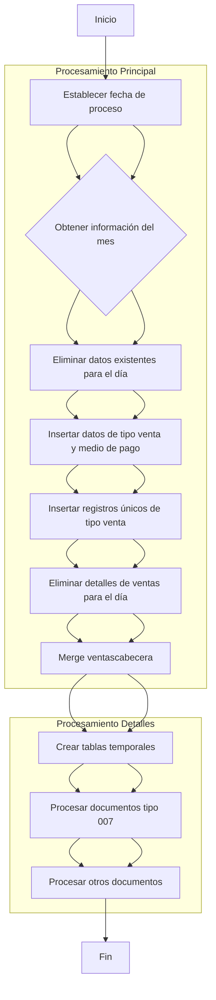
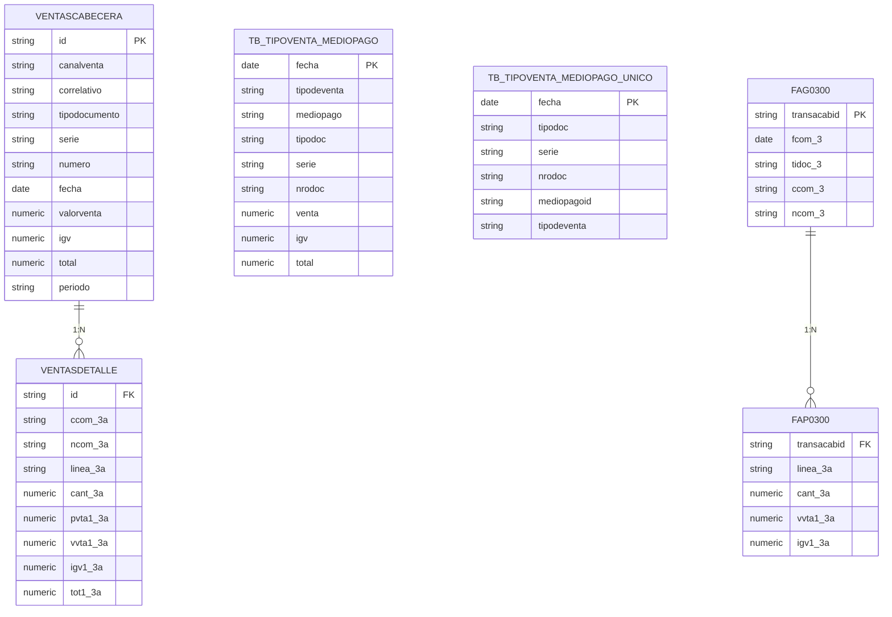

# Documentación del Proceso ETL para Carga de Ventas Diarias

## 1. Diagrama de Flujo de Datos (DFD)

??? info "Explicación del DFD"
    ### Explicación del DFD

    El diagrama muestra el flujo secuencial del procedimiento de migración de ventas diarias:

    1. **Inicialización**: Establece la fecha de proceso (hoy o ayer si no se especifica) y obtiene los rangos del mes actual.

    2. **Limpieza inicial**: Elimina datos existentes para el día en las tablas de resumen (`tb_tipoventa_mediopago` y `tb_tipoventa_mediopago_unico`) y detalles de ventas.

    3. **Carga de datos maestros**: Inserta datos de tipos de venta y medios de pago desde la vista `view_tipoventa_mediopago_DWH` y luego filtra los registros únicos.

    4. **Procesamiento de cabeceras**: Realiza un MERGE complejo en la tabla `ventascabecera` que:
      - Actualiza registros existentes si hay cambios
      - Inserta nuevos registros
      - Elimina registros que ya no existen en el origen

    5. **Procesamiento de detalles**: 
      - Crea tablas temporales para mejorar el rendimiento
      - Procesa separadamente las notas de crédito (tipo 007) con valores negativos
      - Procesa el resto de documentos con valores positivos

    El flujo es principalmente secuencial con algunas operaciones en paralelo (como el procesamiento de los diferentes tipos de documentos).

## 2. Diagrama de Entidad-Relación (DER)

??? info "Explicación del DER"
    ### Explicación del DER

    El diagrama muestra las principales entidades involucradas en el proceso:

    1. **VENTASCABECERA**: Tabla principal que almacena los documentos de venta con sus atributos principales como tipo de documento, serie, número, fechas y montos totales. Tiene una relación 1:N con VENTASDETALLE.

    2. **VENTASDETALLE**: Contiene los ítems de cada documento de venta, con información detallada de productos, cantidades y precios. Se relaciona con VENTASCABECERA a través del campo ID.

    3. **TB_TIPOVENTA_MEDIOPAGO**: Tabla de resumen que relaciona tipos de venta con medios de pago, con información consolidada por día.

    4. **TB_TIPOVENTA_MEDIOPAGO_UNICO**: Versión filtrada de la anterior que contiene solo las combinaciones únicas de tipo de venta y medio de pago por documento.

    5. **FAG0300 y FAP0300**: Tablas origen en la base de datos de pasarela que contienen respectivamente las cabeceras y detalles de las transacciones. Mantienen una relación 1:N similar a las tablas de destino.

    El diagrama muestra cómo los datos fluyen desde las tablas origen (FAG0300/FAP0300) hacia las tablas de destino en el data warehouse, pasando por tablas de resumen intermedias.