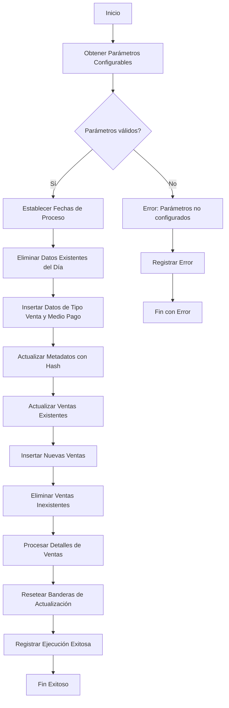
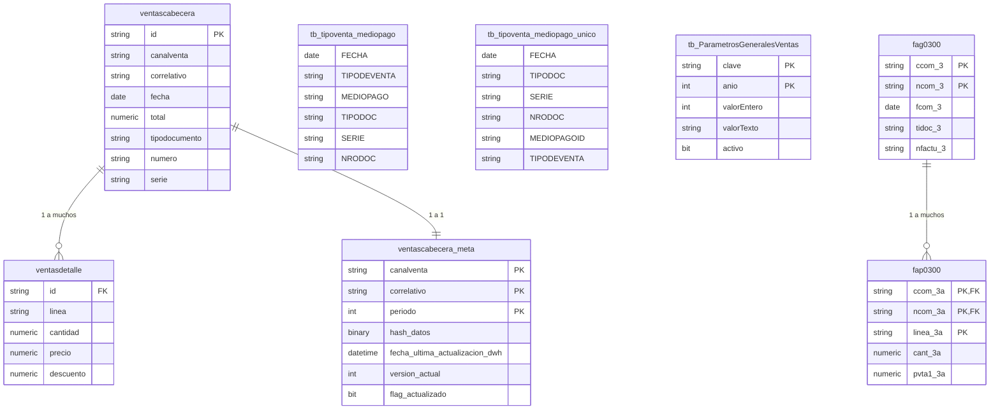

# Diagramas y Documentación para el Procedimiento Almacenado de Ventas

## 1. Diagrama de Flujo de Datos (DFD) en Mermaid

### Explicación del DFD:

Este diagrama representa el flujo secuencial del procedimiento almacenado `usp_actualizar_ventas_con_meta`. El proceso:

1. **Inicia** obteniendo parámetros configurables de la tabla `tb_ParametrosGeneralesVentas`, que determinan el comportamiento del proceso (días de recovery, meses de actualización, campos para hash).

2. **Valida** estos parámetros antes de continuar, registrando un error si faltan configuraciones esenciales.

3. **Establece** el rango de fechas para el procesamiento basado en los parámetros obtenidos.

4. **Prepara el terreno** eliminando datos existentes para el día en tablas de resumen.

5. **Carga datos frescos** de ventas con su tipo y medio de pago desde la vista `view_tipoventa_mediopago_DWH`.

6. **Actualiza metadatos** usando un hash dinámico para identificar cambios en los registros fuente.

7. **Sincroniza** las ventas existentes con los datos fuente, actualizando solo los campos de negocio.

8. **Inserta** nuevas ventas que no existían previamente en la base de datos.

9. **Elimina** registros que ya no existen en la fuente.

10. **Procesa detalles** de ventas con lógica especial para notas de crédito (valores negativos).

11. **Finaliza** limpiando banderas y registrando el resultado del proceso.

El flujo maneja adecuadamente errores mediante transacciones y registro detallado de fallos.

## 2. Diagrama de Entidad-Relación (DER) en Mermaid

### Explicación del DER:

El diagrama muestra las principales entidades involucradas:

1. **ventascabecera**: Tabla principal de ventas con información de cabecera.
2. **ventasdetalle**: Contiene los ítems de cada venta, relacionada con ventascabecera.
3. **ventascabecera_meta**: Almacena metadatos técnicos para control de cambios.
4. **Tablas de tipo venta/medio pago**: Almacenan información adicional de clasificación.
5. **tb_ParametrosGeneralesVentas**: Configuración del proceso ETL.
6. **Tablas fuente (fag0300/fap0300)**: Estructuras origen de los datos.

Las relaciones clave son:
- Ventas cabecera-detalle (1 a muchos)
- Ventas cabecera-metadatos (1 a 1)
- Documentos fuente cabecera-detalle (1 a muchos)

## Nombre Técnico Sugerido para el Documento:

**"ETL_Ventas_ProcedimientoAlmacenado_ActualizacionConMeta.md"**

Justificación:
- **ETL_Ventas**: Indica que es un proceso de extracción, transformación y carga de datos de ventas.
- **ProcedimientoAlmacenado**: Especifica el tipo de artefacto documentado.
- **ActualizacionConMeta**: Destaca la característica distintiva de usar metadatos/hash para control de cambios.

Este nombre sigue convenciones técnicas claras, es autoexplicativo y facilita la búsqueda en el portal de documentación.